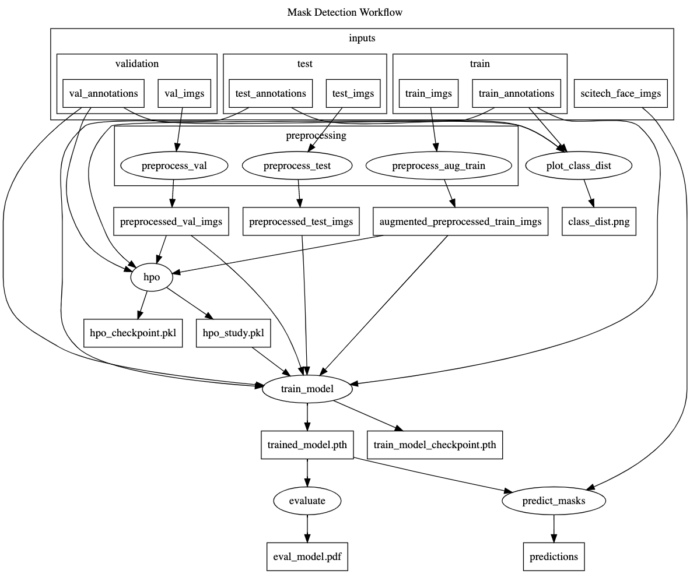

# Pegasus Workflow for Mask Detection and Classification

This is a research intern project by Kelsie Lam.

### Currently implemented jobs in Pegasus


### Running the Workflow

* Clone the respository using the command `git clone <repository link>`
* `cd` into the `mask-detection-workflow` directory
*  [Optional] If you want to add your own docker image, go to `workflow.py` file and change the image in 

    ```python
    mask_detection_wf_cont = Container(
                "mask_detection_wf",
                Container.DOCKER,
                image="docker://patkraw/mask-detecton-wf:latest"
            )
    ``` 
    
  part, to the link to your docker image
* Run the workflow script using the command `python3 run_workflow.py`
* Check 

### Overview of the Workflow


### Detail view of jobs in the Workflow



### Results


